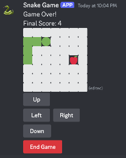

# Discord Snake Game 🐍

A simple snake game implemented as a Discord bot. This bot allows users to play a classic Snake game within your Discord server.



## Prerequisites

Before getting started, ensure you have the following installed on your system:

- [Node.js](https://nodejs.org/en)
- [A Discord Developer Application](https://discord.com/developers/applications)

## Installation

1. Clone the repository
   
    ```sh
    git clone https://github.com/ThisIsFayad/Discord-Snake-Game.git
    cd Discord-Snake-Game
    ```
2. Install dependencies

   ```sh
   npm install
   ```
3.	Configure the discord bot

    Create a .env file in the main directory and add your Discord bot token, which can be found in [Discord Developer Application](https://discord.com/developers/applications)
    ```sh
    DISCORD_TOKEN=<YOU-DISCORD-APP-TOKEN>
    ```


## Running the bot

1. Start the bot

   ```sh
   npm start
   ```

2.	Invite the bot to your server

 - In you Discord Application Dashboard, go to OAuth2, check the bot scope and assign permissions (e.g., Send Messages, Read Messages, and Add Reactions).
 - Copy the generated URL and use it to invite the bot to your server.

Once the bot is running, use the `/play` command in your Discord server to start a new game.

> [!NOTE]
> This bot has been tested with one game instance running at a time. Multiple instances might cause issues due to Discord limitations on the amount of edits made per second.